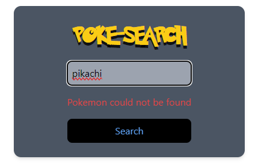
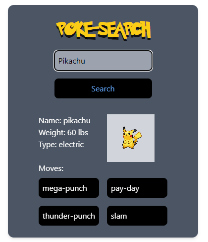
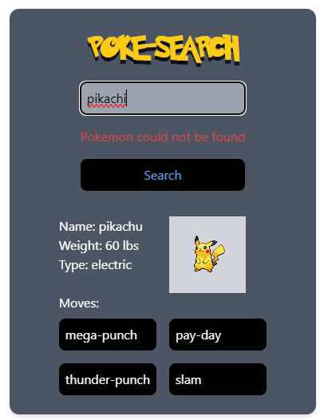

# Pokemon Search

This project is a simple Pokemon search application built with React and Vite.

## Table of Contents

- [Installation](#installation)
- [Usage](#usage)
- [Features](#features)

## Installation

To install the project, clone the repository and run `npm install` in the project directory.

## Usage

To start the development server, run `npm run dev`. This will start the Vite server and the application will be available at `http://localhost:3000`.

## Features

The Pokemon Search application allows users to search for Pokemon by name. The application uses the [PokeAPI](https://pokeapi.co/) to fetch data about the Pokemon.

When a user enters a Pokemon name and clicks the "Search" button, the application fetches data about the Pokemon and displays it. The displayed information includes the Pokemon's name, weight, type, and a picture of the Pokemon.

If the user enters a name that does not correspond to a Pokemon, an error message is displayed under the search bar.

The application is styled with Tailwind CSS, and the Pokemon font is imported from a CDN.

  

    
    
  

  

    
    
  

